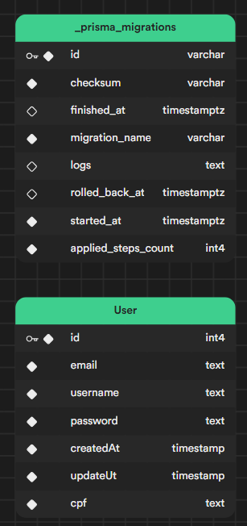
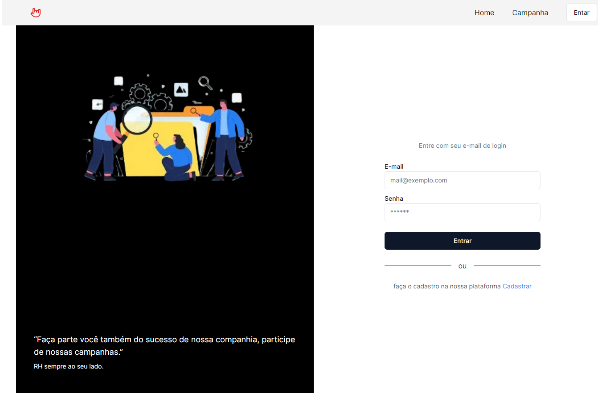

# Desenvolvimento de Produtos de Software

Desafio da matéria é:

- Considere que é necessário que você crie um cadastro dos logins para esse sistema com os campos (login , senha, nome, cpf).


## Licença 📃


## Create new project

Install my-project with npm

```bash
  npx create-next-app@latest my app
  cd my-app
```
Install node_modules
```bash
  npm Install
```
Start project
```bash
  npm run dev
```
    
## Professor

 - [Marco Moreira](mailto:marcomoreira@uniaraxa.edu.br)


## Aluno

- Nome: Jeison Espindola Tomio
- Curso: Desenvolvimento de Produtos de Software I

## Tech Stack

**Nextjs 13:** Diretório App | Roteamento | Layouts | Pages | API Routes

**React 18:** Server | Client Components

**Data Base:** Prisma | Mongodb

**Components:** Shadcn/ui | Radix/ui | Tailwindcss | Eslint

**Authentication:** NextAuth.js | Authjs (páginas personalizadas)


## Schema do DB User

<p align="center">
  
</p>


## Deploy

- [Preview do Deploy](https://www.google.com)

<p align="center">
  
</p>
